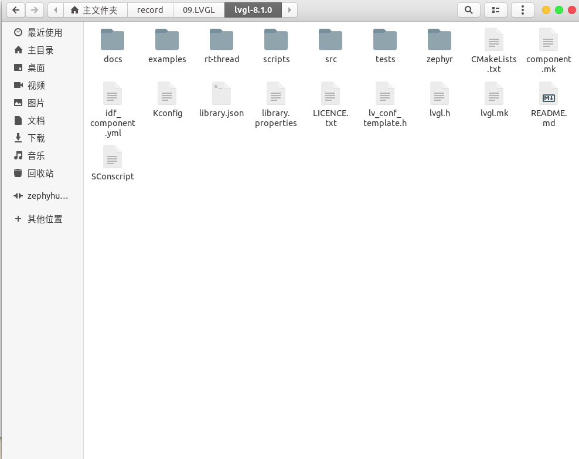
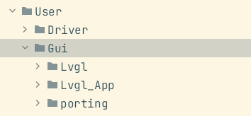

# Lvgl-Stm32 基于FreeRtos的移植
## 1.新建stm32工程--见HAL库教程
## 2.下载lvgl源码包，这儿我选择V8.2.0
> https://github.com/lvgl/lvgl
### 2.1. 解压下载的源码包

> 需要添加到工程中的只有src, lvgl.h, lv_conf_template.h去掉template，和example中的porting
### 3.2. 将文件添加到新建的stm32工程中
> --此处基于clion(使用cmake管理工程的IDE都是类似的)

+ 新建User目录，User下新建Gui Lvgl(存放lvgl代码)，Lvgl_App(存放应用)，Driver(存放屏幕驱动)，拷贝example中的porting到User/Gui目录下
+ 
+ ...网上可以看看别人移动了哪些文件，后续再更新
+ > https://blog.csdn.net/qq_36347513/article/details/122719322 这个是比较新的8.0以上的

